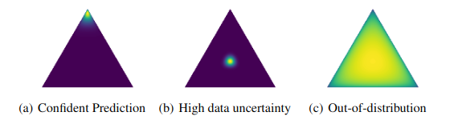

# EXPLORING DIRICHLET BASED MODELS #

## Introduction ##
This repository contains code for exploring the capabilities of Dirichlet based models for prediction and uncertainty quantification.

The final aim is to explore the combination of different models as an ensemble of distributions of distributions (ensemble of second order distributions).

## Background ##
There has been a lot of research since the introduction of the three types of uncertainty encompassed inside the predictive uncertainty:

- **Aleatoric uncertainty**: uncertainty due to the inherent stochasticity of the system.
- **Epistemic uncertainty**: uncertainty due to the lack of knowledge about the system.
- **Distributional uncertainty**: uncertainty due to the fact that the data is not enough to determine the distribution of the data.

The preferred options for uncertainty quantification often involve sampling techniques like Monte Carlo Dropout, Bayesian Neural Networks or Ensemble methods.
These methods work by sampling different solutions/models from the posterior distribution of the weights of the neural network, and then using these samples to 
compute the epistemic (mutual information) and aleatoric (mean entropy) uncertainties.
Although effective, these methods are often computationally expensive and not always feasible for real-time applications.

A different approach from sampling methods that also allows to generate second order distributions is the use of Dirichlet based models.
These models are based on the Dirichlet distribution, which is a distribution over the simplex (a generalization of the Beta distribution to more than two variables) and 
is the prior to the Categorical distribution.

Let $\textbf{x}$ denote the input features and $y$ the labels. For a Bayesian model, the predictive uncertainty $p(y=\omega_c|\textbf{x}.\mathcal{D})$ on the data set 
$\mathcal{D}= \{ x_j,y_j \} _{j=1}^N$ is given by the posterior predictive distribution and describes both model and data uncertainty. Let $\theta$ denote
the model parameters. The posterior predictive distribution is given by: 
$$p(y=\omega_c|\textbf{x},\mathcal{D}) =\int \underbrace{p(y=\omega_c|\textbf{x},\theta)} _{data}\underbrace{p(\theta|\mathcal{D})} _{model}d\theta \label{eq1.1}\tag{1}$$

where $p(y=\omega_c|\textbf{x},\theta)$ is the likelihood and $p(\theta|\mathcal{D} )$ is the posterior distribution of the model parameters.

This integral is often intractable, so it is approximated by sampling methods.

### Dirichlet Based Methods ###
Dirichlet based methods are a different approach to uncertainty quantification. They are based on the Dirichlet distribution, which is a distribution over the simplex (a generalization of the Beta distribution to more than two variables) 
and is the prior to the Categorical distribution. It is normally chosen due to its tractable analytical properties and its ability to model uncertainty in the form of a distribution over distributions.
A Dirichlet distribution is defined by a vector of concentration parameters $\alpha=[\alpha_1,\dots,\alpha_K]$, where $K$ is the number of classes and $\alpha_0=\sum_{c=1}^K \alpha_c$ is called the *precision* of the distribution (also denoted $S$).
$$\text{Dir}(\mu|\alpha)=\frac{\Gamma(alpha_0)}{\prod_{c=1}^K \Gamma(\alpha_c)}\prod_{c=1}^K \mu_c^{\alpha_c-1}, \quad \alpha_c>0, \quad \alpha_0=\sum_{c=1}^K\alpha_c \label{eq2.1}\tag{2}$$

where $\mu=[\mu_1,\dots,\mu_K]$ is a vector of probabilities that sums to one.

## Prior Networks vs Evidential Neural Networks ##
There is a slight difference between these two types of Neural Networks. 